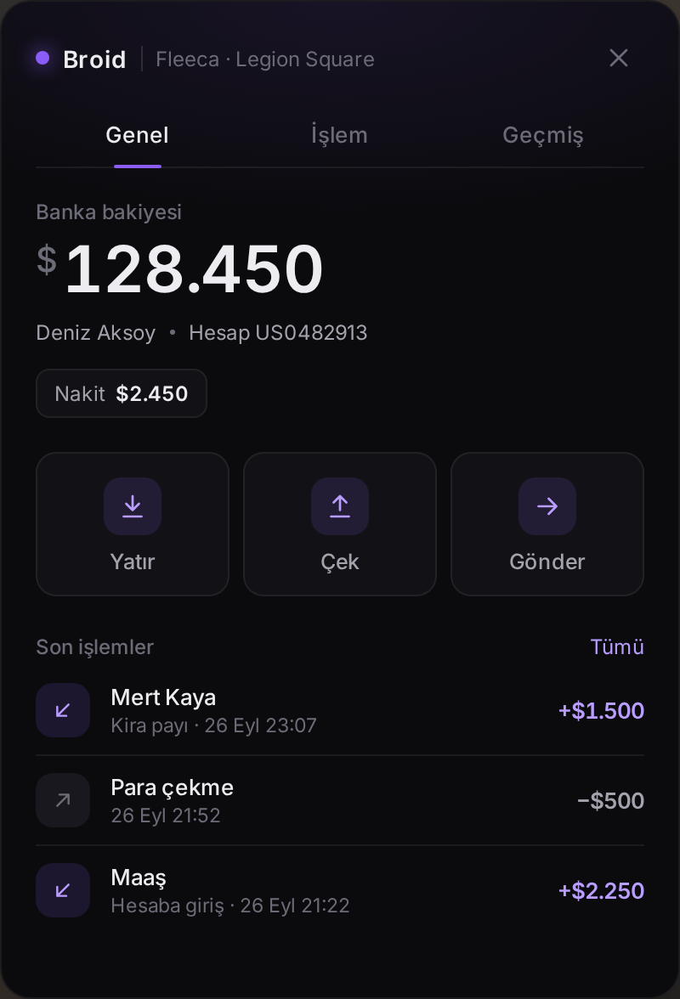
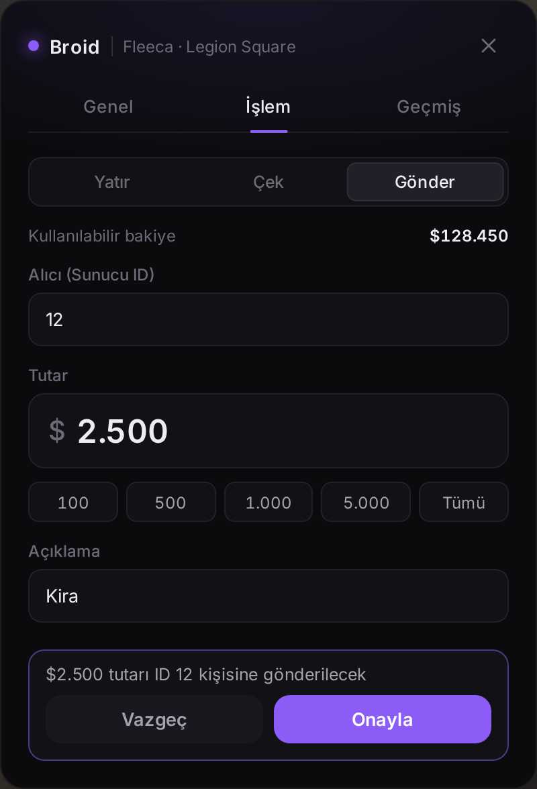
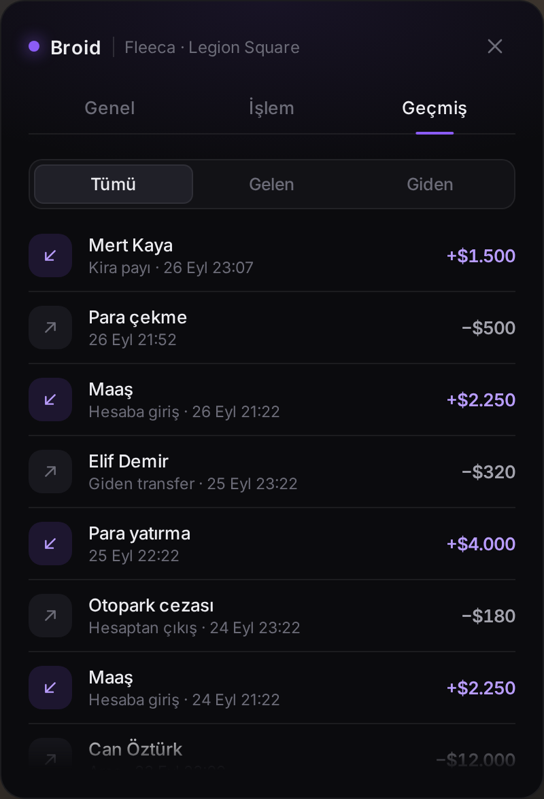

# broid-bank

Qbox için minimal banka ve ATM arayüzü. Siyah zemin, mor vurgu, tek kart.

<p>
  
  
  
</p>

## Özellikler

- **Banka:** yatırma, çekme, sunucu ID'siyle transfer (onay adımıyla) ve işlem geçmişi
- **ATM:** yatırma, çekme ve bakiye; tek seferde çekim limiti var
- Bankalarda `E` tuşu + ekranda ipucu (ox_lib textUI); ATM'ler haritadaki ATM prop'larından otomatik bulunur
- İşlem geçmişi MySQL'de tutulur. Maaş, ceza, kartla ödeme gibi başka scriptlerden gelen banka hareketleri de kaydedilir
- Transfer alan oyuncu bildirim alır; bankası açıksa bakiyesi anında güncellenir
- Tüm doğrulamalar sunucuda: tutar, bakiye, mesafe, bekleme süresi, ATM limiti
- Türkçe ve İngilizce çeviriler `locales/` klasöründe

## Gereksinimler

- [qbx_core](https://github.com/Qbox-project/qbx_core)
- [ox_lib](https://github.com/overextended/ox_lib)
- [oxmysql](https://github.com/overextended/oxmysql)

## Kurulum

1. Klasörü `resources` içine `broid-bank` adıyla koyun.
2. `server.cfg` dosyasına bağımlılıklardan **sonra** ekleyin:

   ```cfg
   setr ox:locale "tr"
   ensure broid-bank
   ```

3. Sunucuyu başlatın. `broid_bank_transactions` tablosu ilk açılışta otomatik oluşturulur (elle kurmak isterseniz `sql/install.sql`).

Derlenmiş arayüz (`web/build`) repoda hazır bulunur, oyunda çalıştırmak için Node.js gerekmez.

## Ayarlar

Tüm ayarlar `config.lua` içindedir:

| Ayar | Açıklama |
| --- | --- |
| `BrandName`, `CurrencySymbol` | Kartın üstündeki isim ve para birimi simgesi |
| `InteractKey`, `InteractDistance` | Etkileşim tuşu ve mesafesi |
| `Cooldown`, `MaxAmount` | İşlemler arası bekleme (ms) ve tek işlemde en yüksek tutar |
| `HistoryLimit`, `PruneDays` | Gösterilen işlem sayısı ve eski kayıtların silinme süresi |
| `LogExternal` | Diğer scriptlerden gelen banka hareketlerini de kaydet |
| `Banks` | Banka konumları ve başlıkta görünen isimleri |
| `Atm` | ATM'leri aç/kapat, çekim limiti ve prop modelleri |
| `Blip` | Harita işaretleri |

Metinleri değiştirmek için `locales/tr.json` dosyasını düzenleyin. Yeni bir dil eklemek için aynı anahtarlarla `locales/<dil>.json` oluşturup `ox:locale` değerini değiştirin.

## Arayüzü geliştirme

Arayüz React + Vite + TypeScript ile yazıldı ve `web/` klasöründe duruyor.

```bash
cd web
npm install
npm run dev      # tarayıcıda sahte veriyle açılır, ATM için: http://localhost:5173/?mode=atm
npm run build    # web/build klasörünü yeniden üretir
```

Tasarım renkleri `web/src/styles.css` dosyasının başındaki değişkenlerdedir (`--bg`, `--accent` vb.).

## Notlar

- ATM prop'ları sunucu tarafında görünmediği için ATM oturumu, oyuncunun açtığı konuma göre doğrulanır. Bu yüzden transfer yalnızca bankalarda yapılabilir ve ATM çekimleri limitlidir.
- Transferde alıcının oyunda olması gerekir.
